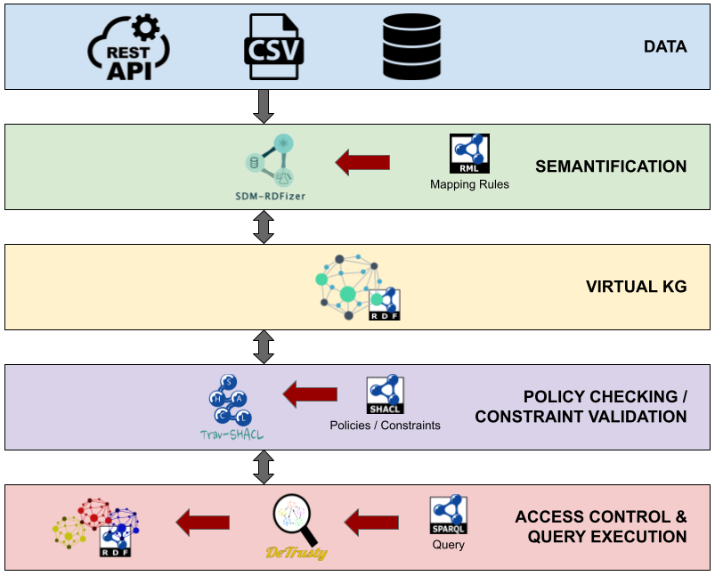

# SHACL-ACL: Access Control with SHACL

SHACL Access Control Lists (SHACL-ACL) is a policy-based access control approach for policies defined in the Shapes Constraint Language (SHACL) [\[1\]](#1).
When a SPARQL [\[2\]](#2) query is posed, SHACL-ACL validates the access control policies defined in SHACL.
The policies are validated against a virtual knowledge graph.
This virtual knowledge graph is generated on the fly to collect local and external data for the policy evaluation.
The data is gathered from local (e.g., a CSV file) and external (e.g., JSON data from a Web API) sources.
SHACL-ACL is able to do so by utilizing mappings defined in the RDF Mapping Language (RML) [\[3\]](#3).
After the validation, the decision about granting the access is taken.
If no violations were detected, i.e., all requirements are met, the access is granted, the query executed, and the query result returned.
However, if at least one of the policies is violated, the access is denied.
The query is not executed in this case and instead of the query result an error message is returned.

## Demonstration

The Jupyter notebook (`SHACL-ACL.ipynb`) in this repository contains a demonstration of SHACL-ACL.
The access control policies consider the current condition of the executing machine as well as the current weather conditions in Hannover, Germany.
The SPARQL query used in the demonstration returns the life expectancy in Germany for the last three years (in the data) from the World Bank KG.
This knowledge graph contains various indicators like life expectancy, population, inflation, and age distribution per country per year.
Since the decision about granting access cannot be guaranteed with the live data, two additional use cases are included that ensure that at least once the access is denied or granted, respectively.
Click the binder badge at the top in order to execute the notebook yourself.

## Used Concepts / Technologies

- Resource Description Framework (RDF) [\[4\]](#4)
- RDF Mapping Language (RML) [\[3\]](#3)
- Shapes Constraint Language (SHACL) [\[1\]](#1)
- SPARQL Protocol And RDF Query Language (SPARQL) [\[2\]](#2)

## Used Tools

|                 | SDM-RDFizer [\[5\]](#5)                                        | Trav-SHACL [\[6\]](#6)                                                                                                           | DeTrusty [\[7\]](#7)                                    |
|-----------------|----------------------------------------------------------------|----------------------------------------------------------------------------------------------------------------------------------|---------------------------------------------------------|
| **Description** | An efficient RML-compliant engine for knowledge graph creation | A SHACL validator capable of planning the traversal and execution of the validation of a shape schema to detect violations early | Federated query engine over RDF sources                 |
| **Version**     | modified version (see directory `rdfizer`)                     | 1.3.0                                                                                                                            | 0.11.2                                                  |
| **GitHub**      | [SDM-TIB/SDM-RDFizer](https://github.com/SDM-TIB/SDM-RDFizer)  | [SDM-TIB/Trav-SHACL](https://github.com/SDM-TIB/Trav-SHACL)                                                                      | [SDM-TIB/DeTrusty](https://github.com/SDM-TIB/DeTrusty) |

## References
<a name="1">[1]</a> SHACL Specification. 2017. URL: [https://www.w3.org/TR/2017/REC-shacl-20170720/](https://www.w3.org/TR/2017/REC-shacl-20170720/).

<a name="2">[2]</a> SPARQL Specification. 2008. URL: [https://www.w3.org/TR/2008/REC-rdf-sparql-query-20080115/](https://www.w3.org/TR/2008/REC-rdf-sparql-query-20080115/).

<a name="3">[3]</a> A. Dimou, M. Vander Sande, P. Colpaert, R. Verborgh, E. Mannes, R. Van de Walle. RML: A Generic Language for Integrated RDF Mappings of Heterogeneous Data. In: Proceedings of the Workshop on Linked Data on the Web co-located with WWW, CEUR-WS, Aachen, Germany, 2014. URL: [https://ceur-ws.org/Vol-1184/ldow2014_paper_01.pdf](https://ceur-ws.org/Vol-1184/ldow2014_paper_01.pdf).

<a name="4">[4]</a> RDF Specification. 2004. URL: [https://www.w3.org/TR/2004/REC-rdf-primer-20040210/](https://www.w3.org/TR/2004/REC-rdf-primer-20040210/).

<a name="5">[5]</a> E. Iglesias, S. Jozashoori, D. Chaves-Fraga, D. Collarana, M.-E. Vidal. SDM-RDFizer: An RML Interpreter for the Efficient Creation of RDF Knowledge Graphs. In: CIKM ’20:Proceedings of the 29th ACM International Conference on Information & Knowledge Management, ACM, New York, NY,USA, 2020. DOI: [10.1145/3340531.3412881](https://doi.org/10.1145/3340531.3412881).

<a name="6">[6]</a> M. Figuera, P.D. Rohde, M.-E. Vidal. Trav-SHACL: Efficiently Validating Networks of SHACL Constraints. In: The Web Conference, ACM, New York, NY,USA, 2021. DOI: [10.1145/3442381.3449877](https://doi.org/10.1145/3442381.3449877).

<a name="7">[7]</a> P.D. Rohde. DeTrusty v0.11.2. 2023. DOI: [10.5281/zenodo.7670670](https://doi.org/10.5281/zenodo.7670670).
